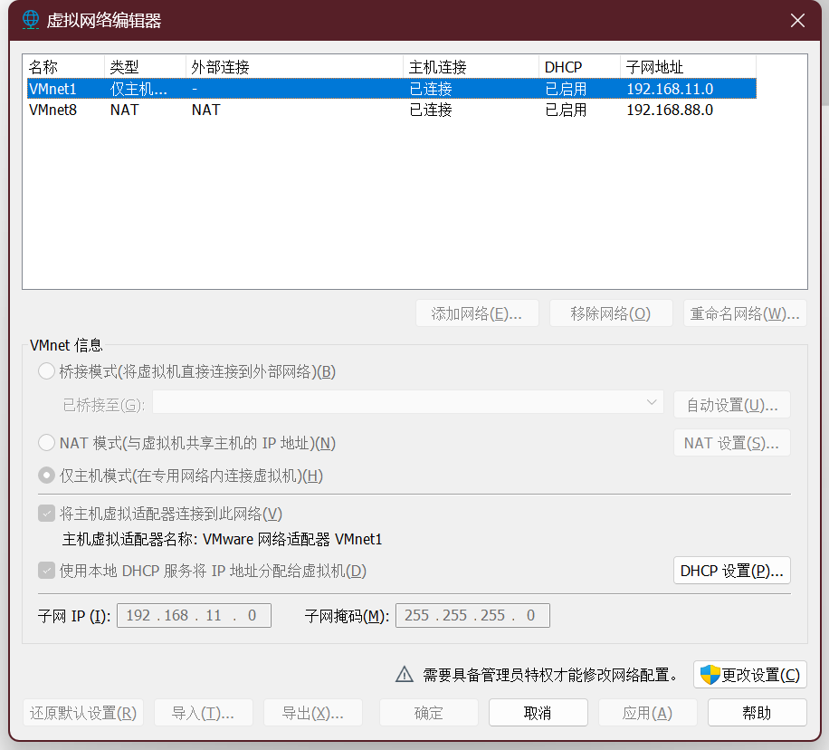

# 一、Windows-Terminal

## 1.1 安装 oh-my-posh

```shell
# 安装（注意环境变量）
$ winget install JanDeDobbeleer.OhMyPosh -s winget
# 下载 nerd 字体
# 使用
$ New-Item -Path $PROFILE -Type File -Force
$ notepad++ $PROFILE
$ oh-my-posh init pwsh | Invoke-Expression
$ . $PROFILE
$ oh-my-posh disable notice
```

## 1.2 配置 ssh

```shell
$ ssh-keygen -t rsa -b 4096 -C "shiyuhanga@163.com"
$ cat ~/.ssh/id_rsa.pub
$ ssh -T git@github.com
```

## 1.3 配置 git

```shell
$ git config --global user.name "sxhwin"
$ git config --global user.email "shiyuhanga@163.com"
$ git config --global color.ui auto
```

# 二、WSL-Arch

## 2.1 安装配置 WSL2

```shell
$ wsl --update
$ wsl --status
# "C:\Users\shiyuhang\.wslconfig"
[wsl2]
memory=4GB
swap=4GB

[experimental]
autoMemoryReclaim=gradual
networkingMode=mirrored
dnsTunneling=true
firewall=true
autoProxy=true

# 用法: wsl.exe [Argument] [Options...][CommandLine]

# 运行 Linux 二进制文件的参数:

    如果未提供命令行，wsl.exe 将启动默认 shell。

    --exec、-e <CommandLine>
        不使用默认 Linux shell 执行指定命令。

    --
        按原样传递剩余命令行。

# 选项:
    --cd <Directory>
        将指定目录设置为当前工作目录。
        如果使用 ~，则将使用 Linux 用户的主路径。如果路径以 / 字符开头，
        它将被解释为绝对 Linux 路径。
        否则，该值必须是绝对 Windows 路径。

    --distribution、-d <Distro>
        运行指定的分发。

    --user、-u <UserName>
        以指定用户身份运行。

    --system
        为系统分发启动 shell。

# 用于管理适用于 Linux 的 Windows 子系统的参数:

    --help
        显示用法信息。

    --install [Options]
        安装其他适用于 Linux 的 Windows 子系统分发。
        有关有效分发的列表，请使用“wsl --list --online”。

        选项:
            --distribution、-d [Argument]
                按名称下载并安装分发。

                参数:
                    有效的分发名称(不区分大小写)。

                示例:
                    wsl --install -d Ubuntu
                    wsl --install --distribution Debian

            --no-launch, -n
                安装后不启动发行版。

    --mount <Disk>
        在所有 WSL2 分发中附加和安装物理磁盘。

        选项:
            --bare
                将磁盘附加到 WSL2，但不要装载它。

            --type <Type>
                装载磁盘时使用的文件系统，如果未指定，则默认为 ext4。

            --options <Options>
                其他装载选项。

            --partition <Index>
                要装载的分区索引，如果未指定，则默认为整个磁盘。

    --set-default-version <Version>
        更改新分发的默认安装版本。

    --shutdown
        立即终止所有正在运行的分发和 WSL 2
        轻型实用程序虚拟机。

    --status
        显示适用于 Linux 的 Windows 子系统的状态。

    --卸载 [Disk]
        从所有 WSL2 分发中卸载并分离磁盘。
        如果不带参数调用，则卸载并分离所有磁盘。

    --更新 [Options]
        如果未指定任何选项，将从 Microsoft Store 下载并安装 WSL。

        选项:
            --回滚
                恢复到 WSL 2 内核的先前版本。

            --inbox
                仅更新收件箱 WSL 2 内核。不从 Microsoft Store 安装 WSL。

            --web-download
                从 internet 而不是 Microsoft  Store 下载 WSL 的最新版本。
# 用于在适用于 Linux 的 Windows 子系统中管理分发的参数:

    --export <Distro> <FileName>
        将分发导出为 tar 文件。
        对于标准输出，文件名可以是 -。

    --import <Distro> <InstallLocation> <FileName> [Options]
        将指定的 tar 文件作为新分发导入。
        文件名可以是 - 用于标准输入。

        选项:
            --version <Version>
                指定用于新分发的版本。

    --list, -l [Options]
        列出分发。

        选项:
            --所有
                列出所有分发，包括当前
                正在安装或卸载的分发。

            --正在运行
                仅列出当前正在运行的分发。

            --安静的, -q
                仅显示分发名称。

            --详细的, -v
                显示有关所有分发的详细信息。

            --在线，-o
                显示可使用“wsl --install”安装的可用分发列表。

    --set-default, -s <Distro>
        将分发设为默认值。

    --set-version <Distro> <Version>
        更改指定分发的版本。

    --终止, -t <Distro>
        终止指定的分发。

    --取消注册 <Distro>
        取消注册分发并删除根文件系统。
```

## 2.2 安装配置 Arch

### 2.2.1 下载安装

```shell
# 下载地址：https://github.com/yuk7/ArchWSL/releases/download/24.4.28.0/Arch.zip
# 解压后两次双击运行Arch.exe
```

### 2.2.2 配置用户信息

```shell
# 给 root 设置密码：123123
[root@sxh Arch]# passwd
New password:
Retype new password:
passwd: password updated successfully
# 创建用户 sxh 并设置密码
[root@sxh Arch]# echo "%wheel ALL=(ALL) ALL" > /etc/sudoers.d/wheel
[root@sxh Arch]# useradd -m -G wheel -s /bin/bash sxh
[root@sxh Arch]# passwd sxh
New password:
Retype new password:
passwd: password updated successfully
[root@sxh Arch]# exit
# 在 Arch.exe 所在文件夹下打开 powershell
$ .\Arch.exe config --default-user sxh
```

### 2.2.3 配置 pacman

```shell
[sxh@sxh ~]$ sudo pacman-key --init
[sxh@sxh ~]$ sudo pacman-key --populate
[sxh@sxh ~]$ sudo pacman -Syy archlinux-keyring
# 换源（清华大学源）添加到首行
[sxh@sxh ~]$ sudo vim /etc/pacman.d/mirrorlist
Server = https://mirrors.tuna.tsinghua.edu.cn/archlinux/$repo/os/$arch
[sxh@sxh ~]$ sudo pacman -Syyu
[sxh@sxh ~]$ sudo pacman -S git openssh base-devel gdb cmake tree which unzip wget
```

### 2.2.4 安装 oh-my-posh

```shell
[sxh@sxh ~]$ mkdir bin
[sxh@sxh ~]$ curl -s https://ohmyposh.dev/install.sh | bash -s -- -d ~/bin
[sxh@sxh ~]$ vim .bashrc
PATH=$PATH:/home/sxh/bin
eval "$(oh-my-posh init bash)"
[sxh@sxh ~]$ . .bashrc
[sxh@sxh ~]$ oh-my-posh disable notice
```

### 2.2.5 配置 ssh

```shell
$ ssh-keygen -t rsa -b 4096 -C "shiyuhanga@163.com"
$ cat ~/.ssh/id_rsa.pub
$ ssh -T git@github.com
```

### 2.2.6 配置 git

```shell
$ git config --global user.name "sxharch"
$ git config --global user.email "shiyuhanga@163.com"
$ git config --global color.ui auto
```

### 2.2.7 配置仓库

```shell
$ mkdir AbortLearing
$ cd AbortLearing
$ git init
$ git add .
$ git commit -m "first commit"
$ git branch -M main
$ git remote add origin git@github.com:sxh12138/AboutLearing.git
$ git push -u origin main --force
$ git branch --set-upstream-to=origin/main main
```

### 2.2.8 安装Python

```shell
$ wget https://www.python.org/ftp/python/3.11.9/Python-3.11.9.tar.xz && tar -xvf Python-3.11.9.tar.xz && rm -rf *.tar.xz && cd Python-3.11.9
$ sudo ./configure && sudo make -j 4 && sudo make install
$ sudo ln -s /usr/local/bin/python3 /usr/local/bin/python
```

### 2.2.9 安装 R

```shell
$ sudo pacman -S r
$ R
install.packages("ggplot2")
q()
$ sudo pacman -S r
```

### 2.2.10 安装 MySQL

```shell
$ sudo pacman -S mysql
$ sudo mariadb-install-db --user=mysql --basedir=/usr --datadir=/var/lib/mysql
$ sudo systemctl start mysqld && sudo systemctl enable mysqld
$ sudo mysql_secure_installation
$ sudo vim /etc/my.cnf
[mysqld]
character-set-server=utf8mb4
collation-server=utf8mb4_unicode_ci

[client]
default-character-set=utf8mb4

[mysql]
default-character-set=utf8mb4
$ sudo systemctl restart mysqld
$ mysql -u root -p
CREATE USER 'sxh'@'localhost' IDENTIFIED BY '123123';
GRANT ALL PRIVILEGES ON *.* TO 'sxh'@'localhost' WITH GRANT OPTION;
FLUSH PRIVILEGES;
EXIT;
$ mysql -u username -p
EXIT;
```

# 三、Vmware-deepin

## 3.1 安装配置 Vmware

```shell
$ ipconfig

Windows IP 配置


无线局域网适配器 本地连接* 1:

   媒体状态  . . . . . . . . . . . . : 媒体已断开连接
   连接特定的 DNS 后缀 . . . . . . . :

无线局域网适配器 本地连接* 10:

   媒体状态  . . . . . . . . . . . . : 媒体已断开连接
   连接特定的 DNS 后缀 . . . . . . . :

以太网适配器 VMware Network Adapter VMnet1:

   连接特定的 DNS 后缀 . . . . . . . :
   本地链接 IPv6 地址. . . . . . . . : fe80::a7e3:e1e:dee:eb6b%62
   IPv4 地址 . . . . . . . . . . . . : 192.168.11.1
   子网掩码  . . . . . . . . . . . . : 255.255.255.0
   默认网关. . . . . . . . . . . . . :

以太网适配器 VMware Network Adapter VMnet8:

   连接特定的 DNS 后缀 . . . . . . . :
   本地链接 IPv6 地址. . . . . . . . : fe80::bbdf:61c8:5547:767d%63
   IPv4 地址 . . . . . . . . . . . . : 192.168.88.1
   子网掩码  . . . . . . . . . . . . : 255.255.255.0
   默认网关. . . . . . . . . . . . . :

无线局域网适配器 WLAN:

   连接特定的 DNS 后缀 . . . . . . . :
   IPv6 地址 . . . . . . . . . . . . : 2408:821a:2201:d7c0:9b49:c1a9:f138:c6a3
   临时 IPv6 地址. . . . . . . . . . : 2408:821a:2201:d7c0:b54a:67dd:2e9:84af
   本地链接 IPv6 地址. . . . . . . . : fe80::71e2:7eb:574:1778%6
   IPv4 地址 . . . . . . . . . . . . : 192.168.1.6
   子网掩码  . . . . . . . . . . . . : 255.255.255.0
   默认网关. . . . . . . . . . . . . : fe80::1%6
                                       192.168.1.1

以太网适配器 蓝牙网络连接:

   媒体状态  . . . . . . . . . . . . : 媒体已断开连接
   连接特定的 DNS 后缀 . . . . . . . :

以太网适配器 以太网:

   媒体状态  . . . . . . . . . . . . : 媒体已断开连接
   连接特定的 DNS 后缀 . . . . . . . :

以太网适配器 vEthernet (Default Switch):

   连接特定的 DNS 后缀 . . . . . . . :
   本地链接 IPv6 地址. . . . . . . . : fe80::930b:b57b:fc59:b369%39
   IPv4 地址 . . . . . . . . . . . . : 172.26.112.1
   子网掩码  . . . . . . . . . . . . : 255.255.240.0
   默认网关. . . . . . . . . . . . . :

以太网适配器 vEthernet (WSL (Hyper-V firewall)):

   连接特定的 DNS 后缀 . . . . . . . :
   本地链接 IPv6 地址. . . . . . . . : fe80::3deb:27b6:90fb:4d3d%50
   IPv4 地址 . . . . . . . . . . . . : 172.23.240.1
   子网掩码  . . . . . . . . . . . . : 255.255.240.0
   默认网关. . . . . . . . . . . . . :
```



## 3.2 安装配置 deepin
