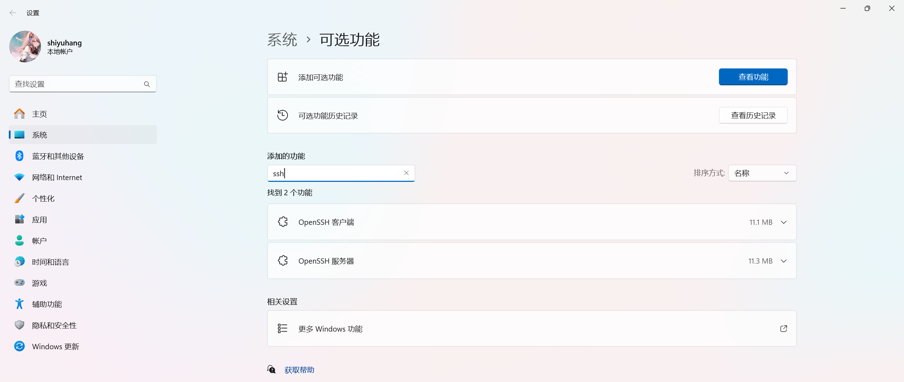
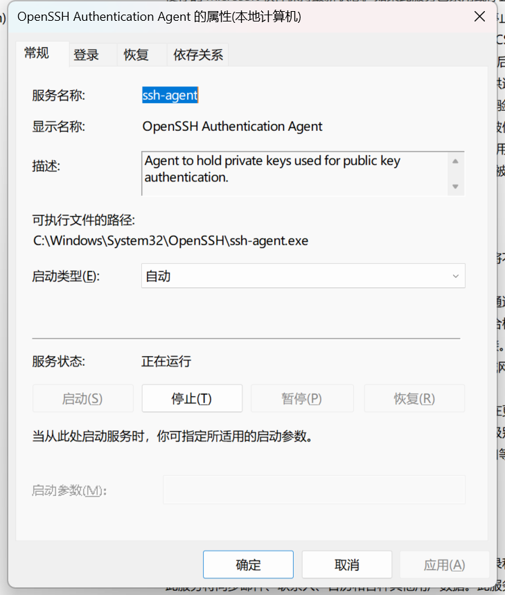

# 一、Windows-Terminal

## 1.1 安装 oh-my-posh

```shell
# 安装（注意环境变量）
$ winget install JanDeDobbeleer.OhMyPosh -s winget
# 下载 nerd 字体
# 使用
$ New-Item -Path $PROFILE -Type File -Force
$ notepad $PROFILE
$ oh-my-posh init pwsh | Invoke-Expression
$ . $PROFILE
$ oh-my-posh disable notice
```

## 1.2 配置 ssh

```shell
$ ssh-keygen -t rsa -b 4096 -C "shiyuhanga@163.com"
$ cat ~/.ssh/id_rsa.pub
$ ssh -T git@github.com
```

## 1.3 配置 git

```shell
$ git config --global user.name "sxhwin"
$ git config --global user.email "shiyuhanga@163.com"
$ git config --global color.ui auto
```

# 二、WSL-Arch

## 2.1 安装配置 WSL2

```shell
$ wsl --update
$ wsl --status
# "C:\Users\shiyuhang\.wslconfig"
[wsl2]
memory=4GB
swap=4GB

[experimental]
autoMemoryReclaim=gradual
networkingMode=mirrored
dnsTunneling=true
firewall=true
autoProxy=true

# 用法: wsl.exe [Argument] [Options...][CommandLine]

# 运行 Linux 二进制文件的参数:

    如果未提供命令行，wsl.exe 将启动默认 shell。

    --exec、-e <CommandLine>
        不使用默认 Linux shell 执行指定命令。

    --
        按原样传递剩余命令行。

# 选项:
    --cd <Directory>
        将指定目录设置为当前工作目录。
        如果使用 ~，则将使用 Linux 用户的主路径。如果路径以 / 字符开头，
        它将被解释为绝对 Linux 路径。
        否则，该值必须是绝对 Windows 路径。

    --distribution、-d <Distro>
        运行指定的分发。

    --user、-u <UserName>
        以指定用户身份运行。

    --system
        为系统分发启动 shell。

# 用于管理适用于 Linux 的 Windows 子系统的参数:

    --help
        显示用法信息。

    --install [Options]
        安装其他适用于 Linux 的 Windows 子系统分发。
        有关有效分发的列表，请使用“wsl --list --online”。

        选项:
            --distribution、-d [Argument]
                按名称下载并安装分发。

                参数:
                    有效的分发名称(不区分大小写)。

                示例:
                    wsl --install -d Ubuntu
                    wsl --install --distribution Debian

            --no-launch, -n
                安装后不启动发行版。

    --mount <Disk>
        在所有 WSL2 分发中附加和安装物理磁盘。

        选项:
            --bare
                将磁盘附加到 WSL2，但不要装载它。

            --type <Type>
                装载磁盘时使用的文件系统，如果未指定，则默认为 ext4。

            --options <Options>
                其他装载选项。

            --partition <Index>
                要装载的分区索引，如果未指定，则默认为整个磁盘。

    --set-default-version <Version>
        更改新分发的默认安装版本。

    --shutdown
        立即终止所有正在运行的分发和 WSL 2
        轻型实用程序虚拟机。

    --status
        显示适用于 Linux 的 Windows 子系统的状态。

    --卸载 [Disk]
        从所有 WSL2 分发中卸载并分离磁盘。
        如果不带参数调用，则卸载并分离所有磁盘。

    --更新 [Options]
        如果未指定任何选项，将从 Microsoft Store 下载并安装 WSL。

        选项:
            --回滚
                恢复到 WSL 2 内核的先前版本。

            --inbox
                仅更新收件箱 WSL 2 内核。不从 Microsoft Store 安装 WSL。

            --web-download
                从 internet 而不是 Microsoft  Store 下载 WSL 的最新版本。
# 用于在适用于 Linux 的 Windows 子系统中管理分发的参数:

    --export <Distro> <FileName>
        将分发导出为 tar 文件。
        对于标准输出，文件名可以是 -。

    --import <Distro> <InstallLocation> <FileName> [Options]
        将指定的 tar 文件作为新分发导入。
        文件名可以是 - 用于标准输入。

        选项:
            --version <Version>
                指定用于新分发的版本。

    --list, -l [Options]
        列出分发。

        选项:
            --所有
                列出所有分发，包括当前
                正在安装或卸载的分发。

            --正在运行
                仅列出当前正在运行的分发。

            --安静的, -q
                仅显示分发名称。

            --详细的, -v
                显示有关所有分发的详细信息。

            --在线，-o
                显示可使用“wsl --install”安装的可用分发列表。

    --set-default, -s <Distro>
        将分发设为默认值。

    --set-version <Distro> <Version>
        更改指定分发的版本。

    --终止, -t <Distro>
        终止指定的分发。

    --取消注册 <Distro>
        取消注册分发并删除根文件系统。
```

## 2.2 安装配置 Arch

### 2.2.1 下载安装

```shell
# 下载地址：https://github.com/yuk7/ArchWSL/releases/download/24.4.28.0/Arch.zip
# 解压后两次双击运行Arch.exe
```

### 2.2.2 配置用户信息

```shell
# 给 root 设置密码：123123
$ passwd
New password:
Retype new password:
passwd: password updated successfully
# 创建用户 sxh 并设置密码
$ echo "%wheel ALL=(ALL) ALL" > /etc/sudoers.d/wheel
$ useradd -m -G wheel -s /bin/bash sxh
$ passwd sxh
New password:
Retype new password:
passwd: password updated successfully
$ exit
# 在 Arch.exe 所在文件夹下打开 powershell
$ .\Arch.exe config --default-user sxh
```

### 2.2.3 配置 pacman

```shell
$ sudo pacman-key --init
$ sudo p$cman-key --populate
$ sudo pacman -Syy archlinux-keyring
# 换源（清华大学源）添加到首行
$ sudo vim /etc/pacman.d/mirrorlist
Server = https://mirrors.tuna.tsinghua.edu.cn/archlinux/$repo/os/$arch
$ sudo pacman -Syyu
$ sudo pacman -S git openssh base-devel gdb cmake tree which unzip wget
```

### 2.2.4 安装 oh-my-posh

```shell
$ mkdir bin
$ curl -s https://ohmyposh.dev/install.sh | bash -s -- -d ~/bin
$ vim .bashrc
PATH=$PATH:/home/sxh/bin
eval "$(oh-my-posh init bash)"
$ . .bashrc
$ oh-my-posh disable notice
```

### 2.2.5 配置 ssh

```shell
$ ssh-keygen -t rsa -b 4096 -C "shiyuhanga@163.com"
$ cat ~/.ssh/id_rsa.pub
$ ssh -T git@github.com
```

### 2.2.6 配置 git

```shell
$ git config --global user.name "sxharch"
$ git config --global user.email "shiyuhanga@163.com"
$ git config --global color.ui auto
```

### 2.2.7 配置仓库

```shell
$ mkdir AbortLearing
$ cd AbortLearing
$ git init
$ git add .
$ git commit -m "first commit"
$ git branch -M main
$ git remote add origin git@github.com:sxh12138/AboutLearing.git
$ git push -u origin main --force
$ git branch --set-upstream-to=origin/main main
```

### 2.2.8 安装Python

```shell
$ wget https://www.python.org/ftp/python/3.11.9/Python-3.11.9.tar.xz && tar -xvf Python-3.11.9.tar.xz && rm -rf *.tar.xz && cd Python-3.11.9
$ sudo ./configure && sudo make -j 4 && sudo make install
$ sudo ln -s /usr/local/bin/python3 /usr/local/bin/python
```

### 2.2.9 安装 R

```shell
$ sudo pacman -S r
$ R
install.packages("ggplot2")
q()
$ sudo pacman -S r
```

### 2.2.10 安装 MySQL

```shell
$ sudo pacman -S mysql
$ sudo mariadb-install-db --user=mysql --basedir=/usr --datadir=/var/lib/mysql
$ sudo systemctl start mysqld && sudo systemctl enable mysqld
$ sudo mysql_secure_installation
$ sudo vim /etc/my.cnf
[mysqld]
character-set-server=utf8mb4
collation-server=utf8mb4_unicode_ci

[client]
default-character-set=utf8mb4

[mysql]
default-character-set=utf8mb4
$ sudo systemctl restart mysqld
$ mysql -u root -p
CREATE USER 'sxh'@'localhost' IDENTIFIED BY '123123';
GRANT ALL PRIVILEGES ON *.* TO 'sxh'@'localhost' WITH GRANT OPTION;
FLUSH PRIVILEGES;
EXIT;
$ mysql -u sxh -p
EXIT;
```

# 三、Vmware-deepin

## 3.1 安装配置 Vmware

```shell
# 网络配置
以太网适配器 VMware Network Adapter VMnet1:

   连接特定的 DNS 后缀 . . . . . . . :
   本地链接 IPv6 地址. . . . . . . . : fe80::cd6:a928:94b6:1436%8
   IPv4 地址 . . . . . . . . . . . . : 192.168.11.1
   子网掩码  . . . . . . . . . . . . : 255.255.255.0
   默认网关. . . . . . . . . . . . . :

以太网适配器 VMware Network Adapter VMnet8:

   连接特定的 DNS 后缀 . . . . . . . :
   本地链接 IPv6 地址. . . . . . . . : fe80::c1d6:fd97:7989:78cb%4
   IPv4 地址 . . . . . . . . . . . . : 192.168.88.1
   子网掩码  . . . . . . . . . . . . : 255.255.255.0
   默认网关. . . . . . . . . . . . . :
```

## 3.2 安装配置 deepin

### 3.2.1 虚拟机硬件配置


### 3.2.2 用户及网络信息


### 3.2.3 配置远程连接（Windows Terminal）

#### 1、Windows部分

##### 1、安装 Openssh Server



##### 2、启动 ssh-agent



##### 3、生成 ssh 秘钥（已生成）

##### 4、添加私钥到 ssh-agent

```shell
$ ssh-add .\.ssh\id_rsa
```

##### 5、配置 ssh config 文件

```shell
$ cd ~/.ssh
$ npp config
Host *
    ForwardAgent yes
Host deepin
    Hostname 192.168.88.88
    Port 22
    User sxh
```

#### 2、Linux 部分

```shell
# 配置 root 密码
$ sudo passwd root
# 安装 vim
$ sudo apt-get update
$ sudo apt-get install vim
# 安装并配置 ssh
$ sudo apt-get install openssh-server
$ sudo systemctl start ssh && sudo systemctl enable ssh
$ ssh-keygen -t rsa -b 4096 -C "shiyuhanga@163.com"
$ cat ~/.ssh/id_rsa.pub
$ ssh -T git@github.com
```

#### 3、Windows 部分

##### 1、拷贝 Windows 公钥到 Linux

```shell
$ cat .\.ssh\id_rsa.pub | ssh deepin 'umask 0077; cat >> .ssh/authorized_keys'
```

##### 2、创建 Windows Terminal 选项卡

```shell
# 打开 json 配置文件，增加如下配置
{
    "guid": "{b453ae63-4e3d-5e58-b989-0a998ec441b8}",
    "hidden": false,
    "name": "deepin",
    "tabTitle": "deepin",
    "suppressApplicationTitle": true,
    "commandline": "ssh deepin"
}
```

### 3.2.4 添加软件源并安装基础软件

```shell
# 添加阿里源
$ sudo vim /etc/apt/sources.list
deb [by-hash=force] https://mirrors.aliyun.com/deepin apricot main contrib non-free
$ sudo apt-get update && sudo apt-get upgrade
$ sudo apt-get install git gdb cmake tree unzip wget build-essential deepin-sdk
# apt-get 用法
# 更新软件包列表
sudo apt-get update

# 升级所有可升级的软件包
sudo apt-get upgrade

# 安装软件包
# 将 package_name 替换为你想安装的软件包名称
sudo apt-get install package_name

# 卸载软件包，但保留配置文件
sudo apt-get remove package_name

# 完全卸载软件包，包括配置文件
sudo apt-get purge package_name

# 搜索软件包
# 将 search_query 替换为你的搜索关键词
apt-get search search_query

# 清理不再需要的软件包
sudo apt-get autoremove

# 清理下载的软件包文件，释放磁盘空间
sudo apt-get clean

# 修复损坏的依赖关系
sudo apt-get install -f

# 显示软件包的详细信息
# 将 package_name 替换为你想查看的软件包名称
apt-cache show package_name

# 升级整个系统，包括处理软件包之间的依赖关系
sudo apt-get dist-upgrade

# 检查是否有损坏的依赖关系
sudo apt-get check
```

### 3.2.5 配置 git

```shell
$ git config --global user.name "sxhdeepin"
$ git config --global user.email "shiyuhanga@163.com"
$ git config --global color.ui auto
```

### 3.2.6 安装 oh-my-posh

```shell
$ mkdir bin
$ curl -s https://ohmyposh.dev/install.sh | bash -s -- -d ~/bin
$ vim .bashrc
PATH=$PATH:/home/sxh/bin
eval "$(oh-my-posh init bash)"
$ . .bashrc
$ oh-my-posh disable notice
```

### 3.2.7 配置仓库

```shell
$ cd
$ git clone git@github.com:sxh12138/AboutLearing.git
$ git branch -M main
$ git branch --set-upstream-to=origin/main main
```

### 3.2.8 安装Python

```shell
$ sudo rm -rf /usr/bin/python
$ sudo rm -rf /usr/bin/python3
$ wget https://www.python.org/ftp/python/3.11.9/Python-3.11.9.tar.xz && tar -xvf Python-3.11.9.tar.xz && rm -rf *.tar.xz && cd Python-3.11.9 && sudo ./configure && sudo make -j 4 && sudo make install && sudo ln -s /usr/local/bin/python3 /usr/local/bin/python
```

### 3.2.9 安装 R

```shell
$ sudo apt-get install r-base
$ R
install.packages("ggplot2")
q()
$ sudo apt-get install r-base
```

### 3.2.10 安装 MySQL

```shell
$ sudo apt-get install mariadb-server
$ sudo mariadb-install-db --user=mysql --basedir=/usr --datadir=/var/lib/mysql
$ sudo systemctl start mysqld && sudo systemctl enable mysqld
$ sudo mysql_secure_installation
$ sudo vim /etc/mysql/my.cnf
[mysqld]
character-set-server=utf8mb4
collation-server=utf8mb4_unicode_ci
[client]
default-character-set=utf8mb4
[mysql]
default-character-set=utf8mb4
$ sudo systemctl restart mysql
$ mysql -u root -p
CREATE USER 'sxh'@'localhost' IDENTIFIED BY '123123';
GRANT ALL PRIVILEGES ON *.* TO 'sxh'@'localhost' WITH GRANT OPTION;
FLUSH PRIVILEGES;
EXIT;
$ mysql -u sxh -p
EXIT;
```

### 3.2.11 安装 clash

```shell
# 安装 ShellCrash
$ sudo -i
$ export url='https://fastly.jsdelivr.net/gh/juewuy/ShellCrash@master' && wget -q --no-check-certificate -O /tmp/install.sh $url/install.sh  && bash /tmp/install.sh && source /etc/profile &> /dev/null
$ crash
请先设置面板访问秘钥 > clash
请先修改Socks服务端口(1-65535) > 7890
请先设置Socks服务密码(账号默认为crash) > clash
请使用 http://192.168.88.88:9999/ui/#/proxies 管理内置规则
# 放行端口
$ sudo apt-get install iptables
$ iptables -I INPUT -p tcp --dport 9999 -j ACCEPT
# 测试
$ curl google.com
```

### 3.2.12 搭建 LNMP 环境以及部署 WordPress

```shell
# 更新系统
$ update
# 编写 hosts
$ sudo vim /etc/hosts
192.168.88.1  sxh
192.168.88.88 deepin
192.168.88.88 www.sxh.com
# 安装 nginx
$ sudo apt-get install nginx
# 安装MariaDB（已完成）
# 安装PHP及其扩展
$ sudo apt-get install php php-fpm php-mysql php-curl php-gd php-mbstring php-xml php-xmlrpc
# 重启服务并设置开机自启
$ sudo systemctl restart nginx && sudo systemctl enable nginx
$ sudo systemctl restart php7.4-fpm && sudo systemctl enable php7.4-fpm
# 下载并配置 WordPress
$ cd /tmp
$ wget https://wordpress.org/latest.tar.gz
$ tar -zxvf wordpress-6.6.2.tar.gz && rm -rf wordpress-6.6.2.tar.gz
$ sudo mysql -u sxh -p
CREATE DATABASE wordpress;
CREATE USER 'wordpressuser'@'localhost' IDENTIFIED BY '123123';
GRANT ALL PRIVILEGES ON wordpress.* TO 'wordpressuser'@'localhost';
FLUSH PRIVILEGES;
EXIT;
$ sudo cp -R /tmp/wordpress/* /var/www/html/ && rm -rf /tmp/wordpress
$ sudo chown -R www-data:www-data /var/www/html/
$ sudo find /var/www/html/ -type d -exec chmod 755 {} \;
$ sudo find /var/www/html/ -type f -exec chmod 644 {} \;
$ sudo vim /etc/nginx/sites-available/default
server {
    listen 80;
    server_name www.sxh.com;

    root /var/www/html;
    index index.php index.html index.htm;

    location / {
        try_files $uri $uri/ /index.php?$args;
    }

    location ~ \.php$ {
        include snippets/fastcgi-php.conf;
        fastcgi_pass unix:/var/run/php/php7.4-fpm.sock;
    }

    location ~ /\.ht {
        deny all;
    }
}
$ sudo systemctl restart nginx
$ curl www.sxh.com
```

